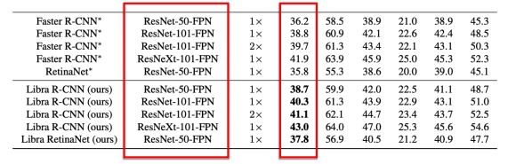

# 1. Deep Neural Network의 출현

## 1.0 Convolutional Neural Network (CNN)
- **CNN** : Y.LeCun에 의해 처음 개발(LeNet, 1989년), Hidden layer로 convolution layer을 사용 
- Convolution layer의 개수가 많은 모델 : Deep Convolutional Neural Network(Deep CNN)

## 1.1 AlexNet의 등장
- Alex Khrizhebsky가 최초로 GPU를 사용하여 Deep CNN 트레이닝 (학습)
- 8개의 weight layer의 Deep CNN, 추가적으로 ReLU, dropout 개발, 적용
- ImageNet 데이터셋에서 분류 성능 대폭 향상 (top-5 acc.기준 + 10% 이상)
    - 10년 이상 지속되었던 성능 정체를 해소

# 2. 딥러닝 모델(backbone)을 통한 이미지 분류/검출기 트레이닝의 개괄

----
[backbone 활용](https://nittaku.tistory.com/270) 
[전이학습?](http://www.gisdeveloper.co.kr/?p=8655) 
[딥러닝을 위한 논문가이드](https://kmhana.tistory.com/3)

----

## 2.0 Backbone이란 = feature extractor
- Backbone (모델) 이란? 큰 데이터셋 (ImageNet 등)에 기 학습된 (pretrained)딥러닝 모델을 칭함
- Backbone은 feature extractor(특징 추출기)입니다
    - Backbone에 이미지를 넣으면 feature가 추출

## 2.0 Transfer learning이란?
- Backbone의 feature을 시작점으로 target task에서 트레이닝을 시작하는 기법
    - Backbone의 weight 파라미터들을 그래도 전이 시켜(transfer) target task 데이터에서 학습 시작  

## Finetuning이란?
- 아래와 같은 object detector (YOLO V1)을 transfer learning을 통해 트레이닝할 때, 추가된 layer을 학습하기 위해 backbone의 weight를 고정하고 미세하게 튜닝하는 것을 finetuning이라고 합니다. 

- 아래와 같은 object detector(SSD)을 transfer learning을 통해 트레이닝할 때, 추가된 layer을 학습하기 위해 backbone의 weight를 고정하고 미세하게 튜닝하는 것을 finetuning이라고 합니다. 
- backbone의 weight 파라미터를 고정하지 않고 트레이닝 하는 경우도 많아, 그 경우도 finetuning

## 2.1 서비스에 딥러닝 모델을 적용한다면
- 실 서비스에 딥러닝 모델을 적용하려면 (예: detection 서비스를 딥러닝 모델로 서빙한다면)
    - Pretrained backbone을 기반 (즉 큰 데이터를 가지고 미리 backbone을 학습)으로 finetuning을 활용해서 target task의 데이터셋에서 학습하는 것이 성능을 확보하는 가장 좋은 방법입니다. 

- 그런데 이러한 target task에서의 성능을 확보하는데 중요한 이슈는 크게,
    - 어떤 큰 데이터를 이용해 딥러닝 모델을 pretraining 할지 여부 : 데이터셋 이슈
    - 어떤 딥러닝 모델을 써서 어떻게 트레이닝 할지 : 딥러닝 모델 선택 & 학습 이슈
    - Pretrained backbone 모델의 성능이 얼마나 뛰어난지 : backbone의 성능 이슈
    - 각 과정에서 트레이닝 세팅 정밀화 여부 : 트레이닝 세팅 이슈

## 2.1 딥러닝 물체 분류/검출기 트레이닝 개요도
> 큰 데이터셋 확보 
    V 
  딥러닝 모델 선택, 큰 데이터에 학습 (pretrain)  
     V 
  Pretrained backbone의 성능 관찰 (evaluation) 
    V 
  목표 데이터셋의 학습 데이터로 학습 (finetuning) 
  V 
  목표 데이터셋에서 검출기 성능 관찰 (evaluation)

## 2.2 큰 데이터셋?: ImageNet
- ImageNet-1k (일반적으로 불리는 ImageNet, http://www.image-net.org):
    - 원래의 데이터셋인 ImageNet-22k (데이터 개수: 14,197,122)의 subset입니다.
- ImageNet-1k외에도 ImageNet-5k 데이터셋이 있습니다
- OpenImage 데이터셋 (V5버전이 나오고 최근에 뜨기 시작)
- Instagram 데이터셋 (ECCV 2018에 등장했지만, 여전히 미공개 데이터셋) 
- 특히 이중에서도 ImageNet-1k가 가장 보편적, 일반적으로 널리 사용됩니다. 

**- 이유는 경험적으로 잘된다는 것이 알려져 있고, 그 외에 연구결과들이 있습니다**

## 2.3 모델 선택
- 딥러닝 모델 선택, 큰 데이터에 학습 (pretrain)
    - ResNet-50, MobileNetV1, ...
    - [ResNet-50 설명](https://towardsdatascience.com/understanding-and-coding-a-resnet-in-keras-446d7ff84d33)
    - [ResNet-50 설명2](https://bskyvision.com/644)
    - [MobileNet 논문](https://paperswithcode.com/method/mobilenetv1)
    - [MobileNet 설명](https://minimin2.tistory.com/42)
    - [비교](https://analyticsindiamag.com/mobilenet-vs-resnet50-two-cnn-transfer-learning-light-frameworks/)
    - [비교2](https://stackoverflow.com/questions/46187766/mobilenet-vs-squeezenet-vs-resnet50-vs-inception-v3-vs-vgg16/46316769)

## 2.3 모델 선택 & 학습
- 어떤 딥러닝 모델을 선택해서 큰 데이터 셋에서 학습할 지를 정해야 합니다.
- ImageNet이 큰 데이터 셋으로 선택되었다면 유명 pretrained모델 (ImageNet에 학습된 모델)이 많이 공개되어 있으므로 선택하면 됩니다.
    - [Benchmark Analysis of Representative
Deep Neural Network Architectures](https://arxiv.org/pdf/1810.00736.pdf)

## 2.3 모델 선택 & 학습: model-zoo
- 공개된 model-zoo:
    - 빠른 deploy를 위해 TensorFlow, PyTorch, Mxnet 등에서 model을 모아놓은 페이지를 공개

## 2.3 모델 선택 & 학습: 기존 모델 사용시
- ImageNet 데이터가 아닌 다른 큰 데이터에 딥러닝 모델을 학습하려 할 때:
    - 이때에도 ImageNet 성능 기준으로 좋은 딥러닝 모델을 선택해서 사용하는 것이 좋습니다
    - 즉, ResNet50, VGG16 등의 모델을 선택한 이후 사용하실 큰 데이터에 트레이닝 하는 것이 좋습니다.
    - 당연히 상황에 따라 모델에 적절한 변화를 가할 수 있습니다 (변화를 시키는 과정이 새로운 모델 개발 과정)
    - "상황에 따라" 추천할만한 모델은 appendix에 있으니 확인

## 2.3 모델 선택 & 학습: 새로운 모델 개발시
- **이미 개발된 딥러닝 구조를 쓰지 않고 딥러닝 모델을 "새롭게" 개발한다면**
    - 1) 사용할 큰 데이터 셋에 맞는 좋은 모델 (성능/속도 측면)을 먼저 설계/연구 (반복 실험 필요)
    - 2) 그리고 학습 방법에 따라 성능이 크게 차이 (정확도 기준ㅇ로 3~5% 이상) 나게 되기 떄문에 학습 방법을 정밀하게 최적화 시도
    - 3) 최적화 후 성능을 기존 모델과 비교 후 좋은 성능이 나오는지 확인 (아니라면 1)로 돌아갑니다)

## 2.4 Backbone의 성능 이슈
- Pretrained backbone의 성능 = ImageNet 데이터셋 분류 성능 ([PDF 링크 문서 참조](#2.3-모델-선택-&-학습))

## 2.4 강력한 성능의 Backbone에 관하여
- Q) 강력한 backbone을 사용해야 하는 구체적 이유?
    - [Kornblith et al., Do Better ImageNet Models Transfer Better?, CVPR 2019](https://arxiv.org/pdf/1805.08974.pdf)
    - Backbone의 성능과 Target task의 성능은 비례

## 2.4 강력한 성능의 Backbone에 관하여
- Q) 강력한 backbone을 사용해야 하는 구체적 이유?
- Object detection을 예로 들면:
    - 아래는 Faster RCNN, Libra RCNN 결과 (Libra R-CNN (CVPR 2019) 논문에서 발췌): 

 
→ ResNet-50-FPN<ResNet-101-FPN<ResNeXt-101-FPN 순으로 backbone 성능이 좋음
→ 모델별 ImageNet 성능차이가 1\~2%정도 나면 target task 성능차이도 2~3%이상

- [모델 간 성능차이 논문](https://arxiv.org/pdf/1701.06659.pdf) 
    → 모델 간 ImageNet classification 성능 차이가 1\~2% 정도가 있고, COCO2017 detection 성능 차이도 2\~3% 
    → 그러나 실제 detection 결과는 매우 차이가 크다 (비행기, 사람, 연을 더 잘 찾기 시작함)

# 3. 최신/유명한 가벼운 딥러닝 모델들 소개와 몇가지 이슈

## 3.0 무거운 (뚱뚱한) 모델들
>WideResNet (arXiv 2016) 
ResNet+ Inception (Inception V4, arXiv 2016) 
Multi-ResNet (arXiv 2017) 
ResNext (ResNet-V3, CVPR 2017) 
PolyNet (CVPR 2017) 
PyramidNet (CVPR2017) 
Xception (CVPR 2017) 
DenseNet (arXiv 2016, 2017(v2)) 
DPN 
SE-Net 
AmoebaNet 
NasNet 
PNas-Net

## 3.0 최신 가벼운 모델들
- 모델 개발 역사) 무거운 모델에서 가벼운 모델로 넘어갈 때 중요한 operator가 개발
되었습니다 
→ (depthwise) separable convolution의 개발 (MobileNetV1 논문에서 첫 등장!) 
→ 연산의 효율성을 비교해 보면 parameter 수가 (b)가 월등히 적습니다:
    - (a) regular conv.: 27 = 3x3x3x1
    - (b) separable conv.: 12 = 3x3 + 1x1x3x1 (depthwise conv.와 pointwise conv.
각각 계산)    

>유명한 모델들: 
SqueezeNet, 
MobileNetV1, MobileNetV2, MobileNetV3 ← depthwise conv. 사용 
ShuffleNetV1, ShuffleNetV2 ← depthwise conv. 사용 
MNasNet, FBNet, CharmNet, EfficientNet 등 ← depthwise conv. 사용 

## 3.1 최신 가벼운 모델들의 성능 재현
- 논문을 잘 따라 ImageNet에 트레이닝 시켜도 리포트된 성능을 얻기 쉽지 않습니다
예) MobileNetV2x1.0 모델, ShuffleNetV2x1.4 등의 모델 
 
- 이유1: 해당 논문들에서 중요 세팅들을 공개하지 않았기 때문
- 이유2: 다수의 GPU (수십 개)를 한번에 써서 트레이닝 하기 쉽지 않기 때문
 

- 즉, 논문의 세팅대로 트레이닝했는데 결과가 도저히 안 나온다면?
- 다른 세팅으로 동일 결과를 얻을 수 있으므로 트레이닝 세팅 스터디를 해야합니다.

>**※ 트레이닝 세팅** 
optimizer 종류, learning rate 값, weight decay 값, epoch 수, 
learning rate scheduling 방법, 
data augmentation 방법/강도, 기타 regularizer 유/무 

## 3.2 특정 모델들의 finetuning 성능 이슈
- 모델의 ImageNet 성능은 좋으나, finetuning 성능이 그만큼 좋지 않습니다: 
    → 예) MobileNetV2, MobileNetV3, MNasNet 
    → [출처](https://arxiv.org/pdf/1905.02244.pdf)

### 3.3 실제 서비스 이슈 – 성능 측면
- 실제 서비스에 backbone들을 적용하기 위해서 고려해야할 요소
    - 성능: backbone의 성능과 finetuning 후 해당 task의 성능
    - 속도: 총 flops (operator들의 총 연산량) 에 속도가 비례하는가?
    - 모델 크기: 모델 파라미터 수와 분포에 따라 training 또는 test 시 GPU 메모리를 얼마나 점유할지 결정, 즉, 한번에 serving할 batchsize에 영향을 줍니다 
 

> **Q) 성능이 무조건 좋은 backbone 을 택하면 되는가?** 
    (A) YES, 단 Flops + 파라미터 수 사이는 대체적으로 비례하므로 이에 따라 적절한 backbone 선택

## 3.3 실제 서비스 이슈 – 성능 측면
- 실제 서비스에 backbone들을 적용하기 위해서 고려해야할 요소
    - 성능: backbone의 성능과 finetuning 후 해당 task의 성능
    - 속도: 총 flops (operator들의 총 연산량) 에 속도가 비례하는가?
    - 모델 크기: 모델 파라미터 수와 분포에 따라 training 또는 test 시 GPU 메모리를 얼마나 점유할지 결정, 즉, 한번에 serving할 batchsize에 영향을 줍니다 

+ 성능과 모델 크기와 달리 속도와 flops이 환경에 따라 비례하지 않는 경우가 종종 있습니다 

>**Q) 모델의 Flop이 작으면 속도도 빨라지는가?** 
    A) 대체적으로 비례하나 꼭 그렇지도 않습니다 (아래 예 참고): 
    - Concatenation이나 depthwise-conv등은 플랫폼에 따라, 하드웨어에 따라 속도가 다름 
        - Flops은 0이나 실제 속도가 느린 Reshape, AveragePool, Upsample 등의
operator들 존재:

+ 단, GPU에서는 현 구현상 이슈로 regular convolution을 쓰는 것이 depthwise convolution이나 group convolution을 쓰는 것보다 훨씬 빠릅니다  
+ 그래서 ResNeXt (ResNetV3) 나 MobileNetV2가 GPU에서 FLOPs 대비 느립니다  

>**Q) 모델의 Flop이 작으면 속도도 빨라지는가?**
    A) 대체적으로 비례하나 꼭 그렇지도 않습니다 (아래 예 참고): 
    - Concatenation이나 depthwise-conv등은 플랫폼에 따라, 하드웨어에 따라 속도가 다름 
        - Flops은 0이나 실제 속도가 느린 Reshape, AveragePool, Upsample 등의 operator들 존재: 
        - [출처](https://arxiv.org/pdf/1807.11164.pdf)

## 3.4 실제 서비스 이슈 – 모델크기 측면
- 실제 서비스에 backbone들을 적용하기 위해서 고려해야할 요소
    - 성능: Accuracy, precision/recall등
    - 속도: 총 flops (operator들의 총 연산량) 에 속도가 비례하는가?
    - 모델 크기: 모델 파라미터 수와 분포에 따라 training 또는 test 시 GPU 메모리를 얼마나 점유할지 결정, 즉, 한번에 serving할 batchsize에 영향을 줍니다 
 

+ 모델 크기는 허용하는 만큼 크게 (성능을 극대화) 선택하는 것이 좋습니다 
+ 그러나 모델 크기가 크다고 속도가 반드시 느려지는 것은 아닙니다

## Appendix: 무거운 딥 러닝 모델 추천
모델 추천 1 (성능 측면): 
1) VGG-16 (파라미터는 많으나, 생각보다 빠르고 성능이 좋음) 
2) ResNet50-SE (ResNet101이나 ResNet152 대비 efficient, GPU 서빙의
마지노선) 
3) ResNeXT101-SE + FPN (FPN은 detection등에 적용할 때 성능에 큰 영향) 
4) Xception 계통 (의외로 효율적이고 강력한 모델, group-conv 기반) 
5) EfficientNet-B4 (효율적이고 성능이 좋지만, dw-conv 기반) 

+ AmoebaNet등의 NAS 기반 거대 모델들은 complexity나 scalability 이슈로 추천하지 않습니다

## Appendix: 가벼운 딥 러닝 모델 추천
모델 추천 2 (속도 측면): 
1) ResNet-18 (ResNet-50보다 빠르지만, 여전히 크기가 큼) 
2) Xception 계통 (CPU용, Xception을 작게 만들어 사용) 
3) MobileNetV1 (CPU용, MobileNetV2보다 더 좋을 때가 많음) 
4) 소개 모델 : [자료 모델 & 출처](https://deview.kr/data/deview/2019/presentation/[115]%EC%96%B4%EB%94%94%EA%B9%8C%EC%A7%80+%EA%B9%8E%EC%95%84%EB%B4%A4%EB%8B%88_%EB%AA%A8%EB%B0%94%EC%9D%BC+%EC%84%9C%EB%B9%84%EC%8A%A4%EB%A5%BC+%EC%9C%84%ED%95%9C+%EA%B0%80%EB%B2%BC%EC%9A%B4+%EC%9D%B4%EB%AF%B8%EC%A7%80+%EC%9D%B8%EC%8B%9D_%EA%B2%80%EC%B6%9C+%EB%94%A5%EB%9F%AC%EB%8B%9D+%EB%AA%A8%EB%8D%B8.pdf) 

+ 그나마 MobileNetV1이 성능 vs 속도 (+ 모델 크기) 면에서 좋은 편이지만, 문제는 finetuning (detection 등) 성능이 모델 크기 대비 좋다고 볼 수는 없습니다 

